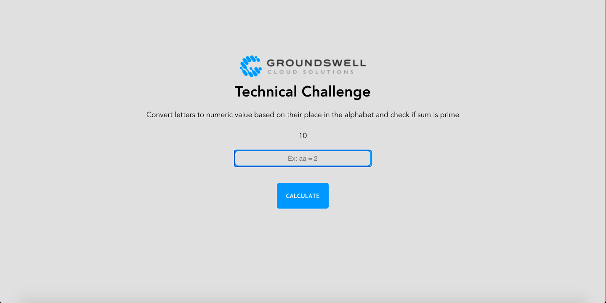

# Groundswell Technical Challenge

## Description
The page should allow up to ten letters of the alphabet to be entered into a text input field. It also has a display button, named Calculate, which when clicked will perform the following functionality:

- Translate each alphabetic character entered as follows – a=1, b=2, c=3, and so on to z=26
- Add the numeric values of each translated character together and display the result on the page
- Check whether the result is a prime number or not and display some text saying which it is

Example 1:
Input: aaa
Output: 3 is a prime number

Example 2:
Input: abc
Output: 6 is not a prime number

Example 3:
Input: azb
Output: 29 is a prime number


## Main Screen


## Technical Notes

This app uses Vue.js with no back end. It has a custom function library called prime.js stored inside the libs directory. It uses Mocha and Chai for unit tests, HTML and CSS for styling, and two Vue components called Navbar and Calculate. 

## Requirements
```
This project requires Node 14.15
```

## Project setup
Step 1: Install Dependencies 
```
npm install
```

Step 2: Run Development Server
```
npm run serve
```

Step 3: View website
```
localhost:8080
```

Step 4: Option to run unit tests
```
npm run test:unit
```

### Compiles and hot-reloads for development
```
npm run serve
```

### Compiles and minifies for production
```
npm run build
```

### Lints and fixes files
```
npm run lint
```